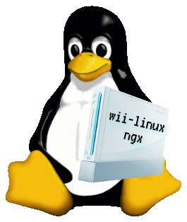

# wii-linux-ngx

Running modern Linux on Wii consoles.

This project provides:
* source code and scripts to compile a working Linux kernel for GC/Wii, in the form of git branches (stable Linux trees + necessary patches)
* kernel single-binary releases in ELF format (zImage)
* ready to use Debian Jessie images/rootfs

See [README](https://github.com/neagix/wii-linux-ngx/tree/master) for a full description and instructions.

# Releases

* [https://github.com/neagix/wii-linux-ngx/releases](https://github.com/neagix/wii-linux-ngx/releases)

# Issues

Visit the issues tracker to see what needs help:
* [https://github.com/neagix/wii-linux-ngx/issues](https://github.com/neagix/wii-linux-ngx/issues)

Pull requests are welcome!

# Frequently Asked Questions

<dl>
<dt>Does the ethernet dongle work?</dt>
<dd>Yes</dd>
<dt>Does the Wi-Fi work?</dt>
<dd>Yes</dd>
<dt>Can I run Xorg on it?</dt>
<dd>Yes, with the framebuffer driver.</dd>
<dt>Does it work on GameCube?</dt>
<dd>It should. GameCube is supported but author cannot test on it.</dd>
<dt>Does SD/SDHC/USB work?</dt>
<dd>Yes</dd>
<dt>What type of multimedia/gaming applications can I use?</dt>
<dd>Anything that works on a framebuffer will do. But forget about video playback, 3D or high end games. There is no hardware acceleration support so far.</dd>
</dl>

# Thanks

Thanks to the following people/organizations/groups:
* the Linux Kernel developers
* the GC-Linux team
* DeltaResero
